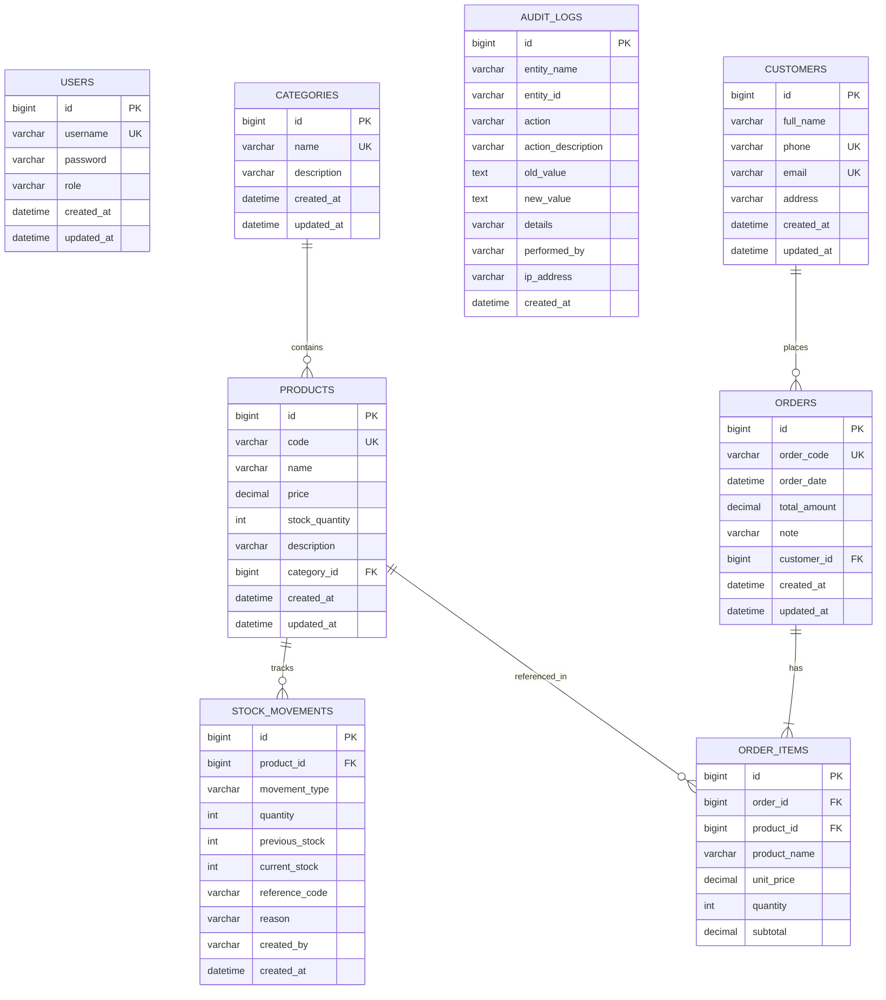

# 🛒 BizPOS — Hệ Thống Quản Lý Bán Hàng & Điểm Bán Lẻ (Retail Point of Sale)

> **BizPOS** là giải pháp phần mềm quản lý bán hàng toàn diện, hiện đại dành cho cửa hàng bán lẻ và chuỗi F&B / Mini Mart. Hệ thống cung cấp đầy đủ các quy trình: Bán hàng tại quầy (POS), Quản lý kho hàng thời gian thực, Xuất/Nhập Excel, Báo cáo doanh thu & Dashboard Analytics, cùng cơ chế Bảo mật và Phân quyền nghiêm ngặt theo chuẩn thị trường.

---

## 📑 Mục lục
- [🚀 Công nghệ sử dụng](#-công-nghệ-sử-dụng)
- [✨ Tính năng nổi bật](#-tính-năng-nổi-bật)
  - [1. Quầy bán hàng thời gian thực (POS)](#1-quầy-bán-hàng-thời-gian-thực-pos)
  - [2. Quản lý kho hàng & Tồn kho tự động (Inventory Management)](#2-quản-lý-kho-hàng--tồn-kho-tự-động-inventory-management)
  - [3. Báo cáo & Phân tích kinh doanh (Sales & Analytics Dashboard)](#3-báo-cáo--phân-tích-kinh-doanh-sales--analytics-dashboard)
  - [4. Xuất / Nhập Excel (Product & Inventory Excel Engine)](#4-xuất--nhập-excel-product--inventory-excel-engine)
  - [5. Quản lý Dữ liệu Danh mục & Khách hàng](#5-quản-lý-dữ-liệu-danh-mục--khách-hàng)
- [🔒 Bảo mật & Ma trận Phân quyền (Security & RBAC)](#-bảo-mật--ma-trận-phân-quyền-security--rbac)
- [🗄️ Cấu trúc Cơ sở dữ liệu (Database Schema)](#️-cấu-trúc-cơ-sở-dữ-liệu-database-schema)
- [🧪 Hệ thống Kiểm thử Tự động (144 Automated Tests)](#-hệ-thống-kiểm-thử-tự-động-144-automated-tests)
- [⚙️ Cài đặt & Khởi chạy](#️-cài-đặt--khởi-chạy)
- [👤 Tài khoản Mặc định](#-tài-khoản-mặc-định)

---

## 🚀 Công nghệ sử dụng

### Backend
* **Ngôn ngữ & Framework**: Java 17, Spring Boot 3.3.4 (Spring Web, Spring Data JPA, Spring Security 6, Spring Validation).
* **Cơ sở dữ liệu & ORM**: MySQL 8.x, Hibernate ORM, HikariCP Connection Pool.
* **Xác thực & Bảo mật**: Stateless JWT Authentication (`io.jsonwebtoken:jjwt:0.12.6`), BCrypt Password Encoder, Method Security (`@PreAuthorize`).
* **Xử lý File Excel**: Apache POI 5.2.5 (`poi-ooxml`).
* **Kiểm thử**: JUnit 5, Mockito, Spring Boot Test, Spring Security Test, MockMvc.

### Frontend
* **Template Engine**: Thymeleaf (Modular Layouts & Fragments).
* **Styling & UI Components**: Bootstrap 5.3, Bootstrap Icons, Custom CSS3 Design System.
* **Giao diện & UX**:
  * Hiệu ứng thanh điều hướng trượt (Sliding indicator transition).
  * Màn hình chờ Skeleton loading (chống layout shift).
  * Hệ thống thông báo Toast Notifications chuẩn REST error handling (400, 401, 403, 404, 409, 500).
* **Biểu đồ**: Chart.js 4.4 (Doanh thu bán hàng theo thời gian thực).

---

## ✨ Tính năng nổi bật

### 1. Quầy bán hàng thời gian thực (POS)
* Tìm kiếm sản phẩm thông minh qua tên hoặc mã SKU.
* Lọc sản phẩm nhanh theo từng danh mục.
* Thẻ sản phẩm hiển thị giá bán và số lượng tồn kho thực tế.
* **Kiểm soát giỏ hàng thông minh**:
  * Chặn thêm vào giỏ nếu sản phẩm đã hết hàng.
  * Chặn tăng số lượng vượt quá mức tồn kho hiện tại trong kho.
* Chọn thông tin khách hàng từ hệ thống hoặc bán cho khách lẻ.
* Áp dụng chiết khấu linh hoạt (% phần trăm hoặc số tiền VND cố định).
* **Tạo đơn hàng trong Transaction**:
  * Tự động trừ số lượng tồn kho sản phẩm ngay khi chốt đơn.
  * Tự động lưu snapshot tên sản phẩm và đơn giá tại thời điểm bán (đảm bảo lịch sử giá không bị thay đổi trong tương lai).
  * Hỗ trợ modal xem trước và in hóa đơn thanh toán chuyên nghiệp cho khách.

### 2. Quản lý kho hàng & Tồn kho tự động (Inventory Management)
* Quản lý trường số lượng tồn kho `stockQuantity` cho từng sản phẩm.
* Cơ chế trừ kho nguyên tử (Atomic Deduction) trong cùng `@Transactional`: rollback toàn bộ nếu có lỗi hoặc hết hàng (`InsufficientStockException`).
* **Xử lý đồng thời (Concurrency Control) & Khóa bi quan (Pessimistic Locking)**:
  * Sử dụng cơ chế khóa dòng độc quyền `SELECT ... FOR UPDATE` (`@Lock(LockModeType.PESSIMISTIC_WRITE)`).
  * Ngăn chặn triệt để hiện tượng **Bán âm kho (Overselling)** và **Ghi đè mất dữ liệu (Lost Update)** khi hàng chục khách hàng/thu ngân cùng tranh mua sản phẩm cuối cùng.
  * **Cơ chế chống Deadlock**: Tự động sắp xếp các mục hàng trong đơn theo thứ tự `productId` tăng dần trước khi khóa dòng trong database, triệt tiêu hoàn toàn nguy cơ Deadlock khi nhiều đơn hàng chứa các sản phẩm chéo nhau.
* Phân loại trực quan trạng thái tồn kho bằng badge:
  * 🟢 **Còn hàng**: Số lượng tồn $> 5$.
  * 🟡 **Sắp hết**: $0 < \text{Số lượng tồn} \le 5$ (ngưỡng cảnh báo).
  * 🔴 **Hết hàng**: $\text{Số lượng tồn} = 0$.
* Hỗ trợ cập nhật số lượng tồn kho thủ công (`PATCH /api/products/{id}/stock`).
* Hoàn lại số lượng tồn kho cũ khi hủy hoặc điều chỉnh đơn hàng.

### 3. Báo cáo & Phân tích kinh doanh (Sales & Analytics Dashboard)
* **KPI Tổng quan**:
  * Tổng doanh thu bán hàng thực tế.
  * Tổng số đơn hàng thành công.
  * Giá trị trung bình trên mỗi đơn hàng (AOV - Average Order Value).
  * Số lượng mặt hàng đang rơi vào ngưỡng cảnh báo tồn kho thấp.
* **Bộ lọc thời gian linh hoạt**:
  * Hôm nay (Today).
  * 7 ngày gần nhất (Last 7 Days).
  * 30 ngày gần nhất (Last 30 Days).
  * Tùy chọn khoảng ngày (`from` $\rightarrow$ `to`) với logic chuẩn hóa thời gian tự động.
* **Biểu đồ Doanh thu (Revenue Trend Line Chart)**:
  * Trực quan hóa doanh thu theo ngày với Chart.js.
  * Thuật toán **Zero-Fill** tự động điền giá trị 0đ cho những ngày không phát sinh giao dịch.
* **Bảng xếp hạng Top 5 Sản phẩm bán chạy**:
  * Thống kê theo số lượng bán ra và doanh thu mang lại.
* **Danh sách cảnh báo tồn kho**:
  * Lọc tự động các sản phẩm có tồn kho $\le 5$ để chủ cửa hàng kịp thời nhập hàng.

### 4. Xuất / Nhập Excel (Product & Inventory Excel Engine)
* **Export Sản phẩm (`GET /api/products/export`)**:
  * Xuất toàn bộ danh sách sản phẩm ra định dạng `.xlsx`.
  * Đầy đủ các cột: *Mã sản phẩm, Tên sản phẩm, Danh mục, Giá bán, Tồn kho, Ngày tạo*.
  * Tự động căn chỉnh độ rộng cột, định dạng số tiền VND và header chuyên nghiệp.
* **Import Sản phẩm (`POST /api/products/import`)**:
  * Đọc file `.xlsx` và tạo sản phẩm hàng loạt.
  * Kiểm tra và validate chi tiết từng dòng (mã trùng DB, rỗng tên, danh mục không tồn tại, giá âm, tồn âm).
  * Báo cáo kết quả import chi tiết (Tổng số dòng, số dòng thành công, số dòng lỗi và lý do cụ thể từng dòng) mà không làm crash request.

### 5. Sổ nhật ký kho / Thẻ kho (Stock Movement Ledger)
* **Append-Only Immutable Ledger**: Thay vì chỉ ghi đè số lượng tồn kho `stockQuantity`, hệ thống ghi nhận mỗi biến động vào bảng `stock_movements` tạo thành thẻ kho bất biến (audit log).
* **Bao phủ toàn diện các loại biến động (`MovementType`)**:
  * `SALE` (Xuất bán hàng): Tự động ghi nhận khi đặt hàng, liên kết với mã đơn hàng `referenceCode` (ví dụ: `ORD-20261007-XXXX`).
  * `IMPORT` (Nhập kho): Ghi nhận khi khởi tạo tồn kho sản phẩm mới hoặc khi nhập hàng loạt từ file Excel (`EXCEL-IMPORT`).
  * `RETURN` (Hoàn trả kho): Ghi nhận khi hủy đơn hàng hoặc cập nhật thay thế món hàng trong đơn.
  * `ADJUSTMENT` (Điều chỉnh tồn kho): Ghi nhận khi nhân viên/quản lý cập nhật kiểm kê số lượng thực tế.
* **Audit Trail minh bạch**: Lưu vết chi tiết `previous_stock` (tồn trước), `current_stock` (tồn sau), `quantity` (số lượng biến động), `reference_code` (mã tham chiếu), `reason` (lý do nghiệp vụ), `created_by` (người thực hiện từ JWT SecurityContext) và `created_at`.
* **REST APIs Thẻ kho**:
  * `GET /api/stock-movements/product/{productId}`: Xem toàn bộ lịch sử thẻ kho của sản phẩm.
  * `GET /api/stock-movements/product/{productId}/paged`: Phân trang thẻ kho theo sản phẩm.
  * `GET /api/stock-movements`: Tra cứu & lọc đa tiêu chí toàn hệ thống (`productId`, `type`, khoảng thời gian `from/to`).

### 6. Nhật ký kiểm toán hệ thống (Audit Trail via Spring AOP)
* **Tự động bắt vết qua Aspect-Oriented Programming (AOP)**: Sử dụng custom annotation `@Auditable` và `AuditAspect` (`@Around`) để can thiệp trong suốt, không làm ô nhiễm (decouple) logic nghiệp vụ cốt lõi.
* **Giám sát chặt chẽ các can thiệp dữ liệu nhạy cảm**:
  * `UPDATE_PRICE` (Sửa giá bán): Tự động phát hiện khi giá sản phẩm bị thay đổi, lưu vết giá cũ vs giá mới (`oldValue` &rarr; `newValue`).
  * `UPDATE_PRODUCT` (Sửa sản phẩm): Lưu vết thông tin tên, mã hàng, tồn kho trước/sau khi sửa.
  * `DELETE_PRODUCT` (Xóa sản phẩm): Chụp lại toàn bộ snapshot thông tin sản phẩm trước khi bị xóa khỏi hệ thống.
  * `UPDATE_ORDER` (Sửa hóa đơn): Lưu vết mã đơn, tổng tiền cũ vs tổng tiền mới, số lượng món hàng bị thay đổi.
  * `DELETE_ORDER` (Hủy / Xóa hóa đơn): Lưu vết mã đơn, tổng tiền của đơn bị hủy nhằm chống thất thoát doanh thu.
* **Audit Metadata toàn diện**: Bảng `audit_logs` lưu trữ `performed_by` (trích xuất từ JWT token người thao tác), `ip_address` (địa chỉ IP máy trạm), `details` (mô tả ngữ cảnh tiếng Việt) và `created_at`.
* **Bảo vệ an toàn thông tin**: Toàn bộ API tra cứu `/api/audit-logs/**` và giao diện Audit Log Modal được bảo vệ nghiêm ngặt — **chỉ tài khoản quản trị `ADMIN` mới có quyền truy cập** (nhân viên `STAFF` bị chặn 403 Forbidden).

### 7. Quản lý Dữ liệu Danh mục & Khách hàng
* **Danh mục (Categories)**: Thêm, sửa, xóa, tra cứu. Ngăn chặn việc xóa danh mục nếu đang có sản phẩm liên kết (trả về HTTP 409 Conflict).
* **Khách hàng (Customers)**: Quản lý hồ sơ khách hàng, tra cứu nhanh theo Tên / Số điện thoại, ràng buộc không trùng SĐT và Email.
* **Đơn hàng (Orders)**: Xem danh sách đơn, phân trang, lọc theo khoảng thời gian và xem chi tiết danh sách món hàng trong từng đơn.

---

## 🔒 Bảo mật & Ma trận Phân quyền (Security & RBAC)

Hệ thống BizPOS tuân thủ chặt chẽ tiêu chuẩn kiểm soát gian lận và thất thoát thu ngân trong ngành bán lẻ:

| Chức năng / API Endpoint | Khách (Chưa đăng nhập) | Nhân viên (STAFF) | Quản trị viên (ADMIN) |
| :--- | :---: | :---: | :---: |
| **Đăng ký & Đăng nhập** (`/api/auth/**`, `/login`) | ✅ Cho phép | ✅ Cho phép | ✅ Cho phép |
| **Bán hàng POS & Tạo đơn hàng** (`POST /api/orders`) | ❌ 401 Unauthorized | ✅ **Cho phép** | ✅ Cho phép |
| **Xem danh sách Sản phẩm, Danh mục, Đơn hàng** | ❌ 401 Unauthorized | ✅ **Cho phép** | ✅ Cho phép |
| **Xem Sổ nhật ký kho / Thẻ kho** (`GET /api/stock-movements/**`) | ❌ 401 Unauthorized | ✅ **Cho phép** | ✅ Cho phép |
| **Xem Dashboard Analytics & Báo cáo** | ❌ 401 Unauthorized | ✅ **Cho phép** | ✅ Cho phép |
| **Cập nhật tồn kho kiểm đếm** (`PATCH /stock`) | ❌ 401 Unauthorized | ✅ **Cho phép** | ✅ Cho phép |
| **Xem Nhật ký kiểm toán** (`GET /api/audit-logs/**`) | ❌ 401 Unauthorized | ⛔ **403 Forbidden** | ✅ **Cho phép** |
| **Sửa giá / Sửa sản phẩm** (`PUT /api/products/{id}`) | ❌ 401 Unauthorized | ⛔ **403 Forbidden** | ✅ **Cho phép** |
| **Sửa hóa đơn đã tạo** (`PUT /api/orders/{id}`) | ❌ 401 Unauthorized | ⛔ **403 Forbidden** | ✅ **Cho phép** |
| **Xóa bất kỳ dữ liệu nào** (`DELETE /api/**`) | ❌ 401 Unauthorized | ⛔ **403 Forbidden** | ✅ **Cho phép** |
| **Xuất danh sách ra file Excel** (`GET /export`) | ❌ 401 Unauthorized | ⛔ **403 Forbidden** | ✅ **Cho phép** |
| **Nhập hàng loạt bằng Excel** (`POST /import`) | ❌ 401 Unauthorized | ⛔ **403 Forbidden** | ✅ **Cho phép** |

> [!IMPORTANT]
> **Chống gian lận thu ngân & Traceability:** Nhân viên (`STAFF`) tuyệt đối không thể tự ý sửa giá bán sản phẩm trên hệ thống hoặc sửa giảm bớt món trong hóa đơn sau khi khách đã thanh toán. Mọi hành vi sửa giá, xóa đơn của `ADMIN` đều bị Spring AOP ghi nhận vĩnh viễn vào `audit_logs` để truy vết trách nhiệm.

---

## 🗄️ Cấu trúc Cơ sở dữ liệu (Database Schema)



---

## 🧪 Hệ thống Kiểm thử Tự động (164 Automated Tests)

BizPOS sở hữu bộ kiểm thử tự động toàn diện bao phủ từ Unit Test nghiệp vụ đến Integration Test trên cơ sở dữ liệu thật MySQL:

```text
Results :
Tests run: 164, Failures: 0, Errors: 0, Skipped: 0
BUILD SUCCESS
```

### 1. Unit Tests (JUnit 5 + Mockito) — 101 tests
* **`AuditLogServiceTest` (4 tests mới)**: Ghi nhận nhật ký kiểm toán, fallback giá trị SYSTEM & IP máy trạm, phân trang lịch sử kiểm toán, truy vấn theo đối tượng tác động.
* **`StockMovementServiceTest` (6 tests)**: Ghi nhận biến động kho, kiểm tra tính toàn vẹn tham số (product null, quantity $\le 0$), truy vấn lịch sử thẻ kho theo sản phẩm, phân trang thẻ kho.
* **`OrderServiceTest` (24 tests)**: Tạo đơn 1 món / nhiều món, snapshot giá từ DB, tính tổng tiền, chiết khấu %, chiết khấu tiền mặt, trừ tồn kho, ghi nhận thẻ kho SALE, rollback khi thiếu tồn kho, cập nhật đơn hàng & hoàn trả tồn kho cũ, xóa đơn hàng.
* **`ProductServiceTest` (17 tests)**: CRUD sản phẩm, trùng mã SKU, giá âm, tồn âm, category không tồn tại, cập nhật tồn kho thủ công & ghi nhận thẻ kho ADJUSTMENT.
* **`CategoryServiceTest` (11 tests)**: CRUD danh mục, tên trùng lặp, chặn xóa danh mục khi có sản phẩm liên kết (409 Conflict).
* **`CustomerServiceTest` (14 tests)**: CRUD khách hàng, trùng SĐT, trùng Email, format dữ liệu.
* **`DashboardServiceTest` (16 tests)**: Tính toán KPI tổng quan, chia AOV (tránh chia cho 0), chuẩn hóa khoảng ngày (Today, 7 ngày, 30 ngày, custom `from/to`), zero-fill biểu đồ doanh thu, Top 5 sản phẩm, lọc tồn kho thấp threshold $\le 5$.
* **`JwtTokenProviderTest` (9 tests)**: Tạo token hợp lệ, parse username & role, validate token, từ chối token hết hạn, token sai định dạng, token bị can thiệp chữ ký.
* **`CustomUserDetailsServiceTest` (3 tests)**: Nạp thông tin người dùng với quyền `ROLE_ADMIN`, `ROLE_STAFF`, xử lý khi user không tồn tại.
* **`JwtAuthenticationFilterTest` (6 tests)**: Kiểm thử bộ lọc JWT, xử lý khi thiếu header, header không phải Bearer, Bearer hợp lệ, token sai, token lỗi.

### 2. Integration Tests (Spring Boot + MockMvc + MySQL thật) — 63 tests
* **`AuditLogIntegrationTest` (4 tests mới)**:
  * Sửa giá sản phẩm (`PUT /api/products/{id}`) tự động kích hoạt Spring AOP `@Around` ghi nhận `UPDATE_PRICE` kèm giá cũ, giá mới và tài khoản thực hiện.
  * Hủy đơn hàng (`DELETE /api/orders/{id}`) tự động ghi nhận `DELETE_ORDER`.
  * Chặn nhân viên (`STAFF`) 403 Forbidden khi cố gắng truy cập `/api/audit-logs`.
  * Cho phép quản trị viên (`ADMIN`) truy xuất danh sách nhật ký kiểm toán.
* **`StockMovementIntegrationTest` (4 tests)**:
  * Bán hàng qua OrderService $\rightarrow$ trừ kho $\rightarrow$ tự động tạo bản ghi `MovementType.SALE` trong `stock_movements` với `previousStock`, `currentStock` và `referenceCode` khớp mã đơn.
  * Điều chỉnh tồn kho thủ công qua `ProductService.updateStock` $\rightarrow$ ghi nhận `MovementType.ADJUSTMENT`.
  * Hủy đơn hàng $\rightarrow$ hoàn trả kho $\rightarrow$ ghi nhận `MovementType.RETURN`.
  * Gọi API `GET /api/stock-movements/product/{id}` trả về danh sách lịch sử thẻ kho chuẩn xác.
* **`OrderConcurrencyIntegrationTest` (2 tests)**:
  * **Đua lệnh đơn sản phẩm:** 20 threads đồng thời tranh mua sản phẩm tồn kho = 10 $\rightarrow$ đúng 10 đơn thành công, 10 đơn bị chặn do hết hàng, tồn kho cuối cùng trong MySQL về đúng 0 (không âm, không lost update).
  * **Chống Deadlock đa sản phẩm:** Chạy song song các luồng đặt hàng mua sản phẩm theo thứ tự ngược chiều nhau (A rồi B vs B rồi A) $\rightarrow$ cơ chế sắp xếp `productId` tăng dần trước khi lock triệt tiêu 100% Deadlock, toàn bộ đơn hoàn tất thành công.
* **`SecurityIntegrationTest` (21 tests)**: Đăng nhập đúng/sai mật khẩu/sai user, đăng ký mới, bảo vệ JWT, phân quyền ADMIN vs STAFF (chặn STAFF khi DELETE, chặn STAFF khi sửa giá sản phẩm, chặn STAFF khi sửa hóa đơn, chặn STAFF khi xuất/nhập Excel).
* **`MasterDataIntegrationTest` (10 tests)**: Kiểm thử HTTP API và quan hệ dữ liệu thật cho Danh mục, Sản phẩm, Khách hàng.
* **`DashboardIntegrationTest` (7 tests)**: Kiểm thử các API `/api/dashboard/summary`, `/revenue`, `/top-products`, `/low-stock` với dữ liệu thực tế từ MySQL.
* **`ProductExcelIntegrationTest` (3 tests)**: Kiểm thử tải file Excel thực tế, nhập file Excel với dữ liệu hợp lệ và kiểm tra báo cáo lỗi chi tiết.
* **`OrderInventoryIntegrationTest` (3 tests)**: Kiểm thử luồng toàn vẹn từ Controller $\rightarrow$ Service $\rightarrow$ DB: Tạo đơn $\rightarrow$ trừ kho $\rightarrow$ rollback khi hết hàng.

---

## ⚙️ Cài đặt & Khởi chạy

### 1. Yêu cầu môi trường
* **Java Development Kit (JDK)**: Phiên bản 17 trở lên.
* **Apache Maven**: Phiên bản 3.8+ (hoặc dùng Maven Wrapper đi kèm).
* **MySQL Database**: Phiên bản 8.0 trở lên.

### 2. Cấu hình cơ sở dữ liệu
Mở file `src/main/resources/application.properties` và chỉnh sửa thông tin kết nối MySQL của bạn:
```properties
spring.datasource.url=jdbc:mysql://localhost:3306/bizpos_db?createDatabaseIfNotExist=true&useSSL=false&serverTimezone=UTC&allowPublicKeyRetrieval=true
spring.datasource.username=root
spring.datasource.password=your_mysql_password
```

### 3. Chạy toàn bộ Test Suite
Để kiểm tra tính toàn vẹn của toàn bộ hệ thống:
```bash
mvn test
```

### 4. Khởi chạy ứng dụng
```bash
mvn spring-boot:run
```

Sau khi khởi chạy thành công, truy cập hệ thống tại:
👉 **`http://localhost:8080/`** (Trang chủ / Thông tin kết nối)  
👉 **`http://localhost:8080/login`** (Trang Đăng nhập & Đăng ký)  
👉 **`http://localhost:8080/pos`** (Màn hình Quầy Bán Hàng POS)  
👉 **`http://localhost:8080/products`** (Quản lý Sản phẩm & Tồn kho & Excel)  
👉 **`http://localhost:8080/orders`** (Quản lý Đơn hàng)  
👉 **`http://localhost:8080/dashboard`** (Báo cáo & Sales Analytics)

---

## 👤 Tài khoản Mặc định

Hệ thống tự động khởi tạo 2 tài khoản mẫu phục vụ kiểm thử và trải nghiệm:

| Tên đăng nhập | Mật khẩu | Quyền hạn (Role) | Chức năng chính |
| :--- | :--- | :---: | :--- |
| **`admin`** | `admin123` | **ADMIN** | Toàn quyền quản trị, sửa giá, sửa đơn, xóa dữ liệu, Xuất / Nhập Excel |
| **`staff`** | `staff123` | **STAFF** | Bán hàng POS, xem báo cáo, tra cứu; bị chặn sửa giá, sửa đơn, xóa và Excel |

---

*Phát triển bởi đội ngũ BizPOS — Giải pháp bán lẻ hiệu quả & bảo mật.*
