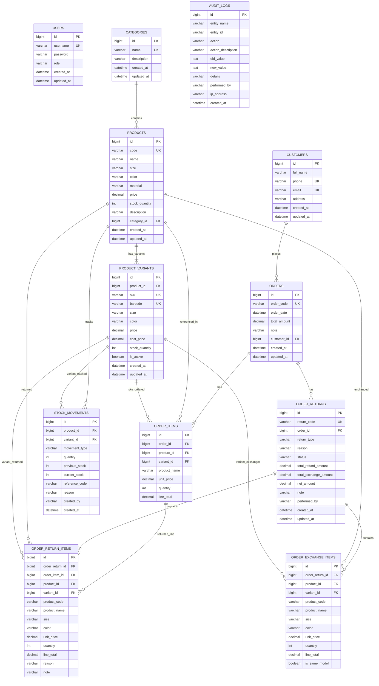

# 👗👠 BizPOS — Hệ Thống Quản Lý Bán Hàng & Điểm Bán Lẻ Thời Trang (Fashion, Apparel & Footwear POS)

> **BizPOS** là giải pháp phần mềm quản lý bán hàng chuyên biệt và toàn diện dành cho chuỗi **Thời trang, Quần áo, Giày dép & Phụ kiện**. Hệ thống giải quyết trọn vẹn bài toán đặc thù của ngành thời trang: quản lý thuộc tính đa dạng (**Kích cỡ / Size, Màu sắc / Color, Chất liệu / Material**), quầy bán hàng POS tốc độ cao, quản lý tồn kho nguyên tử chống bán âm kho, xuất/nhập Excel hàng loạt, và đặc biệt là **Quy trình Đổi - Trả hàng (Return & Exchange)** tự động điều phối tồn kho hai chiều và bù trừ tài chính minh bạch.

---

## 📑 Mục lục
- [🚀 Công nghệ sử dụng](#-công-nghệ-sử-dụng)
- [✨ Tính năng nổi bật](#-tính-năng-nổi-bật)
  - [1. Chuyên biệt hóa ngành Thời trang (Size, Color, Material)](#1-chuyên-biệt-hóa-ngành-thời-trang-size-color-material)
  - [2. Module Đổi - Trả hàng Thông minh (Return & Exchange Engine)](#2-module-đổi---trả-hàng-thông-minh-return--exchange-engine)
  - [3. Quầy bán hàng thời gian thực (POS)](#3-quầy-bán-hàng-thời-gian-thực-pos)
  - [4. Quản lý kho hàng & Sổ thẻ kho (Inventory & Stock Movement Ledger)](#4-quản-lý-kho-hàng--sổ-thẻ-kho-inventory--stock-movement-ledger)
  - [5. Báo cáo & Phân tích kinh doanh (Sales & Analytics Dashboard)](#5-báo-cáo--phân-tích-kinh-doanh-sales--analytics-dashboard)
  - [6. Xuất / Nhập Excel chuyên ngành Thời trang](#6-xuất--nhập-excel-chuyên-ngành-thời-trang)
  - [7. Nhật ký kiểm toán hệ thống (Audit Trail via Spring AOP)](#7-nhật-ký-kiểm-toán-hệ-thống-audit-trail-via-spring-aop)
- [🔒 Ma trận Phân quyền & Chống gian lận (RBAC Matrix)](#-ma-trận-phân-quyền--chống-gian-lận-rbac-matrix)
- [🗄️ Cấu trúc Cơ sở dữ liệu (Database Schema)](#️-cấu-trúc-cơ-sở-dữ-liệu-database-schema)
- [🧪 Hệ thống Kiểm thử Tự động (172 Automated Tests)](#-hệ-thống-kiểm-thử-tự-động-172-automated-tests)
- [⚙️ Cài đặt & Khởi chạy](#️-cài-đặt--khởi-chạy)
- [👤 Tài khoản Mặc định](#-tài-khoản-mặc-định)

---

## 🚀 Công nghệ sử dụng

### Backend
* **Ngôn ngữ & Framework**: Java 17, Spring Boot 3.3.4 (Spring Web, Spring Data JPA, Spring Security 6, Spring Validation).
* **Cơ sở dữ liệu & ORM**: MySQL 8.x, Hibernate ORM (sử dụng `@BatchSize` tối ưu chống `MultipleBagFetchException`), HikariCP Connection Pool.
* **Xác thực & Bảo mật**: Stateless JWT Authentication (`io.jsonwebtoken:jjwt:0.12.6`), BCrypt Password Encoder, Method Security (`@PreAuthorize`).
* **Xử lý File Excel**: Apache POI 5.2.5 (`poi-ooxml`).
* **Kiểm thử**: JUnit 5, Mockito, Spring Boot Test, Spring Security Test, MockMvc.

### Frontend
* **Template Engine**: Thymeleaf (Modular Layouts & Fragments).
* **Styling & UI Components**: Bootstrap 5.3, Bootstrap Icons, Custom CSS3 Design System.
* **Giao diện & UX**:
  * Bộ lọc kích cỡ (Size Filter) thông minh trên thanh tìm kiếm POS.
  * Modal Đổi - Trả hàng 4 bước tương tác chuẩn UX bán lẻ.
  * Màn hình chờ Skeleton loading (chống layout shift).
  * Hệ thống Toast Notifications chuẩn REST error handling (400, 401, 403, 404, 409, 500).
* **Biểu đồ**: Chart.js 4.4 (Doanh thu bán hàng thời gian thực).

---

## ✨ Tính năng nổi bật

### 1. Kiến trúc Chuẩn Ngành Thời trang: Phân cấp SPU — SKU (Product & ProductVariant)
* **Tách bạch Mẫu mã (SPU) và Biến thể (SKU)**:
  * **Product (SPU - Standard Product Unit)**: Đại diện cho mẫu thiết kế chung (*Tên mẫu, Mã phong cách, Danh mục, Chất liệu, Giá gốc tham chiếu*).
  * **ProductVariant (SKU - Stock Keeping Unit)**: Đại diện cho từng sản phẩm vật lý cụ thể (*Mã SKU riêng, Barcode EAN-13, Kích cỡ Size, Màu sắc, Giá bán ghi đè, Tồn kho độc lập*).
* **Ma trận biến thể Size × Màu sắc (Variant Matrix Generator)**:
  * Tự động sinh tổ hợp biến thể khi tạo sản phẩm mới thông qua các thẻ chọn nhanh kích cỡ (`S`, `M`, `L`, `XL`, `XXL`, `29`, `30`, `31`, `32`, `Freesize`) và danh sách màu sắc.
  * Tự động tạo mã vạch chuẩn quốc tế **EAN-13** (đầu số quốc gia `893` của Việt Nam) tính kèm số kiểm tra Check Digit chuẩn GS1 (`893 + 9 chữ số ngẫu nhiên + 1 số kiểm tra checksum`).
* **Hỗ trợ ghi đè giá theo biến thể (Variant Price Override)**:
  * Cho phép các size ngoại cỡ hoặc màu sắc đặc biệt áp dụng giá bán riêng biệt so với mẫu gốc.
* **Flyway Migration không mất dữ liệu (Zero-Downtime Data Migration)**:
  * Tự động di chuyển toàn bộ dữ liệu đơn hàng cũ, thẻ kho và phiếu đổi trả sang khóa ngoại `variant_id` bằng script Flyway `V1.1`.

### 2. Module Đổi - Trả hàng Thông minh (Return & Exchange Engine)
Quy trình Đổi - Trả hàng giải quyết trọn vẹn bài toán có tỷ lệ phát sinh cao nhất trong ngành bán lẻ thời trang (15% - 30% doanh số):
* **Chính sách hạn đổi trả (Policy Enforcement)**: Tự động kiểm tra hóa đơn gốc trong thời hạn quy định (mặc định: **tối đa 7 ngày** kể từ ngày mua hàng).
* **Tìm kiếm sản phẩm đổi mới siêu tốc (Type-to-Search & Autocomplete)**:
  * Thay thế toàn bộ dropdown cũ bằng ô tìm kiếm gợi ý tức thì qua API `/api/products/variants/search?keyword=...`.
  * Hỗ trợ tìm kiếm theo Tên mẫu, Mã SKU hoặc quét mã vạch Barcode.
* **Nhận diện trực quan Cùng mẫu vs Khác mẫu**:
  * Tự động đối chiếu biến thể chọn đổi với các sản phẩm đang được trả:
    * Huy hiệu màu xanh lá: **`[Cùng mẫu (Đổi size)]`** khi đổi kích cỡ/màu trong cùng một mã sản phẩm cha.
    * Huy hiệu màu xanh dương: **`[Khác mẫu]`** khi đổi sang mẫu sản phẩm khác.
* **Hỗ trợ 2 hình thức nghiệp vụ**:
  1. **Trả hàng hoàn tiền (`RETURN_ONLY`)**: Khách trả lại sản phẩm, hệ thống hoàn tiền và cộng lại số lượng vào kho của đúng biến thể SKU.
  2. **Đổi hàng lấy mẫu mới (`EXCHANGE`)**: Khách đổi sang size khác (cùng mẫu) hoặc đổi sang mẫu hoàn toàn khác có giá trị tương đương / cao hơn / thấp hơn.
* **Tự động tính toán bù trừ tài chính ($\Delta = \text{Tiền đổi mới} - \text{Tiền hàng trả}$)**:
  * $\Delta > 0$: Khách cần bù thêm tiền cho cửa hàng.
  * $\Delta < 0$: Cửa hàng hoàn lại tiền chênh lệch cho khách.
  * $\Delta = 0$: Đổi ngang giá trị (ví dụ: đổi cùng một mẫu áo từ Size M sang Size L).
* **Kiểm soát & Chống gian lận (Anti-Fraud & Over-return Protection)**:
  * Ràng buộc số lượng theo từng biến thể: $\text{Số lượng trả} \le \text{Số lượng đã mua} - \text{Số lượng đã trả trước đó}$.
  * Chặn tuyệt đối hành vi hoàn trả vượt quá số lượng trên hóa đơn gốc (HTTP 400 Bad Request).
* **Điều phối tồn kho hai chiều & Khóa bi quan (Pessimistic Locking)**:
  * Biến thể trả: Tăng tồn kho SKU, ghi thẻ kho loại **`RETURN`** kèm mã phiếu đổi trả và `variant_id`.
  * Biến thể đổi mới: Giảm tồn kho SKU, ghi thẻ kho loại **`SALE`** kèm mã phiếu đổi trả và `variant_id`.
  * Cơ chế khóa dòng `PESSIMISTIC_WRITE` trên danh sách `productId` sắp xếp tăng dần triệt tiêu nguy cơ Deadlock khi nhiều quầy POS cùng thao tác.
* **Biên lai Đổi - Trả**: Tự động sinh mã phiếu định dạng `RET-YYYYMMDDHHmmss-XXXX`, hiển thị thông tin thu ngân, khách hàng, lý do (*Mặc chật, Rộng size, Lỗi vải, Không ưng màu, Đổi ý...*), thông tin biến thể đổi/trả và hỗ trợ in biên lai ngay tại quầy.

### 3. Quầy bán hàng thời gian thực (POS)
* **Quét mã vạch Barcode tức thì**: Thanh tìm kiếm POS hỗ trợ đầu đọc mã vạch (Barcode Scanner) quét trực tiếp mã EAN-13 / SKU để thêm ngay biến thể vào giỏ hàng.
* **Popup chọn nhanh Size & Màu**: Khi click vào sản phẩm có nhiều biến thể, hệ thống hiển thị modal trực quan cho phép thu ngân chọn kích cỡ và màu sắc có sẵn trong kho.
* **Quản lý giỏ hàng theo Biến thể**: Giỏ hàng hiển thị chi tiết tên mẫu, mã SKU, nhãn Size, Màu sắc và kiểm tra tồn kho độc lập theo từng biến thể.
* **Kiểm soát giỏ hàng thông minh**: Chặn bán khi biến thể hết hàng (`stockQuantity <= 0`), cảnh báo khi biến thể sắp hết kho ($\le 5$).
* **Tạo đơn hàng nguyên tử trong `@Transactional`**, trừ kho biến thể, ghi thẻ kho kèm snapshot giá tại thời điểm bán để bảo toàn doanh thu.
* Tạo đơn hàng nguyên tử trong `@Transactional`, lưu snapshot giá tại thời điểm bán để bảo toàn doanh thu.

### 4. Quản lý kho hàng & Sổ thẻ kho (Inventory & Stock Movement Ledger)
* **Append-Only Immutable Ledger**: Mỗi biến động kho đều được lưu vết vào bảng `stock_movements`.
* Đầy đủ các loại biến động (`MovementType`):
  * `SALE`: Xuất bán hàng tại quầy hoặc xuất hàng đổi mới.
  * `RETURN`: Nhập hoàn kho khi khách trả hàng hoặc hủy hóa đơn.
  * `IMPORT`: Nhập kho ban đầu hoặc import từ file Excel.
  * `ADJUSTMENT`: Điều chỉnh kiểm kê thực tế tại cửa hàng.
* Ghi nhận đầy đủ: `previous_stock` (tồn trước), `current_stock` (tồn sau), `quantity` (số lượng biến động), `reference_code` (mã chứng từ liên kết), `reason` (lý do) và `created_by` (tài khoản thực hiện).

### 5. Báo cáo & Phân tích kinh doanh (Sales & Analytics Dashboard)
* KPI Tổng quan: Tổng doanh thu, Số đơn hàng thành công, Giá trị trung bình đơn hàng (AOV), Số mặt hàng chạm ngưỡng cảnh báo tồn kho.
* Biểu đồ doanh thu Chart.js với thuật toán **Zero-Fill** tự động bù giá trị 0đ cho ngày không có giao dịch.
* Lọc linh hoạt: *Hôm nay, 7 ngày gần nhất, 30 ngày gần nhất, hoặc tùy chọn khoảng ngày `from - to`*.
* Top 5 sản phẩm thời trang bán chạy nhất và danh sách cảnh báo cần nhập thêm hàng.

### 6. Xuất / Nhập Excel chuyên ngành Thời trang
* **Export Sản phẩm (`GET /api/products/export`)**: Xuất danh sách sản phẩm ra file `.xlsx` chuyên nghiệp, hỗ trợ đầy đủ các cột thuộc tính: *Mã SKU, Tên sản phẩm, Danh mục, Size, Màu sắc, Chất liệu, Giá bán, Tồn kho*.
* **Import Sản phẩm (`POST /api/products/import`)**: Nhập hàng loạt sản phẩm từ file Excel, tự động validate mã trùng, giá bán, số lượng tồn kho và thuộc tính kích cỡ/màu sắc mà không làm gián đoạn request.

### 7. Nhật ký kiểm toán hệ thống (Audit Trail via Spring AOP)
* Tự động bắt vết bằng Spring AOP `@Around("@annotation(Auditable)")`:
  * `UPDATE_PRICE`: Phát hiện sửa giá bán sản phẩm, lưu vết giá cũ vs giá mới.
  * `UPDATE_PRODUCT`: Lưu vết thay đổi thông tin sản phẩm.
  * `DELETE_PRODUCT`: Lưu snapshot toàn bộ thông tin sản phẩm trước khi xóa.
  * `DELETE_ORDER`: Lưu vết mã đơn và tổng tiền khi hủy đơn hàng.
  * `CREATE_RETURN` / `CREATE_EXCHANGE`: Lưu vết toàn bộ giao dịch đổi - trả hàng.
* Toàn bộ API `/api/audit-logs/**` được bảo vệ nghiêm ngặt: **chỉ tài khoản `ADMIN` mới có quyền truy cập**.

---

## 🔒 Ma trận Phân quyền & Chống gian lận (RBAC Matrix)

Hệ thống BizPOS tuân thủ chặt chẽ tiêu chuẩn kiểm soát gian lận và thất thoát trong ngành bán lẻ:

| Chức năng / API Endpoint | Khách (Chưa đăng nhập) | Nhân viên (STAFF) | Quản trị viên (ADMIN) |
| :--- | :---: | :---: | :---: |
| **Đăng nhập & Lấy token** (`/api/auth/**`, `/login`) | ✅ Cho phép | ✅ Cho phép | ✅ Cho phép |
| **Bán hàng POS & Tạo đơn hàng** (`POST /api/orders`) | ❌ 401 Unauthorized | ✅ **Cho phép** | ✅ Cho phép |
| **Tra cứu điều kiện Đổi - Trả** (`GET /api/returns/eligible/**`) | ❌ 401 Unauthorized | ✅ **Cho phép** | ✅ Cho phép |
| **Thực hiện Đổi - Trả hàng** (`POST /api/returns`) | ❌ 401 Unauthorized | ✅ **Cho phép** | ✅ Cho phép |
| **Xem danh sách Sản phẩm, Danh mục, Đơn hàng** | ❌ 401 Unauthorized | ✅ **Cho phép** | ✅ Cho phép |
| **Xem Sổ thẻ kho** (`GET /api/stock-movements/**`) | ❌ 401 Unauthorized | ✅ **Cho phép** | ✅ Cho phép |
| **Xem Dashboard Analytics** (`GET /api/dashboard/**`) | ❌ 401 Unauthorized | ✅ **Cho phép** | ✅ Cho phép |
| **Cập nhật tồn kho kiểm đếm** (`PATCH /stock`) | ❌ 401 Unauthorized | ✅ **Cho phép** | ✅ Cho phép |
| **Xem Nhật ký kiểm toán** (`GET /api/audit-logs/**`) | ❌ 401 Unauthorized | ⛔ **403 Forbidden** | ✅ **Cho phép** |
| **Sửa giá / Sửa sản phẩm** (`PUT /api/products/{id}`) | ❌ 401 Unauthorized | ⛔ **403 Forbidden** | ✅ **Cho phép** |
| **Sửa hóa đơn đã tạo** (`PUT /api/orders/{id}`) | ❌ 401 Unauthorized | ⛔ **403 Forbidden** | ✅ **Cho phép** |
| **Xóa bất kỳ dữ liệu nào** (`DELETE /api/**`) | ❌ 401 Unauthorized | ⛔ **403 Forbidden** | ✅ **Cho phép** |
| **Xuất danh sách ra file Excel** (`GET /export`) | ❌ 401 Unauthorized | ⛔ **403 Forbidden** | ✅ **Cho phép** |
| **Nhập hàng loạt bằng Excel** (`POST /import`) | ❌ 401 Unauthorized | ⛔ **403 Forbidden** | ✅ **Cho phép** |

---

## 🗄️ Cấu trúc Cơ sở dữ liệu (Database Schema)



---

## 🧪 Hệ thống Kiểm thử Tự động (185 Automated Tests - 100% Pass)

BizPOS sở hữu bộ kiểm thử tự động toàn diện bao phủ từ Unit Test nghiệp vụ đến Integration Test trên cơ sở dữ liệu thật MySQL:

```text
Results :
Tests run: 185, Failures: 0, Errors: 0, Skipped: 0
BUILD SUCCESS
Total time:  18.408 s
```

### 1. Integration Tests Mô hình SPU — SKU (`ProductVariantIntegrationTest`) — 6 tests
* **`createProductWithVariants_shouldPersistHierarchicalHierarchy`**: Tạo mẫu cha (SPU) và liên kết ma trận biến thể con (SKU: M, L, XL), kiểm tra tính toàn vẹn phân cấp và độc lập tồn kho.
* **`variantBarcode_shouldFollowEan13Standard`**: Kiểm định thuật toán sinh mã vạch quốc tế EAN-13: 13 chữ số, đầu số quốc gia `893` và Check Digit chuẩn GS1.
* **`variantPriceOverride_shouldWorkIndependently`**: Xác minh tính năng ghi đè giá bán theo kích cỡ (size XL giá cao hơn size thường mà không làm ảnh hưởng giá gốc).
* **`orderWithVariant_shouldDeductVariantStockAndRecordMovement`**: Bán hàng theo biến thể SKU, trừ kho chính xác ở cấp biến thể và ghi nhận thẻ kho gắn `variant_id`.
* **`exchangeWithVariant_sameModelVsDifferentModel_shouldDetectCorrectly`**: Đổi hàng theo biến thể, tự động xác định chính xác cờ `isSameModel = true` (khi đổi size cùng mẫu) và `isSameModel = false` (khi đổi mẫu khác).
* **`pessimisticLocking_onProductAndVariants_shouldPreventOverselling`**: Khóa bi quan chống bán vượt tồn kho đồng thời trên các biến thể cùng mẫu.

### 2. Integration Tests Module Đổi - Trả hàng Thời trang (`OrderReturnIntegrationTest`) — 8 tests
* **`getEligibleReturnInfo_shouldReturnCorrectQuantities`**: Tra cứu đơn hàng mới mua trong hạn 7 ngày, tính toán chính xác số lượng đã mua, đã trả và số lượng còn được phép trả theo từng dòng hóa đơn.
* **`processReturn_returnOnly_shouldIncreaseStockAndRecordMovement`**: Xử lý trả hàng hoàn tiền (`RETURN_ONLY`), tăng tồn kho chính xác, ghi nhận thẻ kho `RETURN`, tính đúng tiền hoàn.
* **`processReturn_exchange_shouldUpdateBothStocksAndCalculateNet`**: Xử lý đổi hàng lấy mẫu mới (`EXCHANGE`), tồn kho món trả tăng 1 (`RETURN`), tồn kho món mới giảm 1 (`SALE`), tính đúng tiền bù trừ chênh lệch ($\Delta = \text{Đổi mới} - \text{Hoàn trả}$).
* **`processReturn_shouldFail_whenReturningMoreThanRemaining`**: Chống gian lận: Chặn đứng yêu cầu trả vượt quá số lượng đã mua (trả về HTTP 400 Bad Request).
* **`getEligibleReturnInfo_shouldBeIneligible_whenExpired`**: Kiểm tra vi phạm chính sách: Đơn hàng mua quá hạn 7 ngày bị đánh dấu `eligible = false` và chặn tạo phiếu đổi trả.
* **`processReturn_shouldFail_whenProductNotInOrder`**: Chặn yêu cầu trả sản phẩm không tồn tại trong hóa đơn gốc.
* **`processReturn_raceCondition_twoCashiersReturningSameOrder_shouldPreventDoubleReturn`**: **Kiểm thử đua lệnh (Concurrency / Race Condition)**: Hai thu ngân cùng xử lý trả cho một hóa đơn tại cùng một thời điểm. Hệ thống khóa bi quan `PESSIMISTIC_WRITE` trên hóa đơn gốc ngay khi bắt đầu giao dịch, đảm bảo tuần tự hóa tuyệt đối, chỉ đúng 1 thu ngân thành công, chặn đứng nguy cơ hoàn tiền gấp đôi.
* **`processReturn_withSameProductAtDifferentPrices_shouldAccuratelyTrackOrderItemAndRefundExactPrice`**: **Định danh chính xác dòng hóa đơn (`order_item_id`)**: Khi đơn hàng có cùng sản phẩm ở 2 dòng với 2 mức giá khác nhau (ví dụ: dòng giá sale 200k và dòng giá gốc 300k), việc đổi trả định danh chính xác dòng được trả qua `order_item_id`, hoàn tiền đúng từng đồng theo đơn giá của dòng đó và bảo toàn độc lập hạn mức đổi trả cho dòng còn lại.

### 3. Integration Tests Module Thanh toán POS (Tiền mặt & Chuyển khoản VietQR) — 5 tests
* **`createOrder_withCashPayment_exactAmount_shouldCalculateZeroChange`**: Thanh toán tiền mặt đưa đúng số tiền, xác nhận `amountPaid = totalAmount` và `changeAmount = 0`.
* **`createOrder_withCashPayment_greaterAmount_shouldCalculateCorrectChange`**: Thanh toán tiền mặt đưa thừa tiền, tự động tính chính xác tiền thừa trả khách (`changeAmount = amountPaid - totalAmount`).
* **`createOrder_withCashPayment_insufficientAmount_shouldThrowException`**: Khách đưa thiếu tiền mặt, chặn đứng tạo đơn và trả lỗi HTTP 400 Bad Request kèm thông điệp cảnh báo rõ ràng.
* **`createOrder_withBankTransfer_shouldSetAmountPaidEqualTotal`**: Thanh toán chuyển khoản ngân hàng (VietQR Napas247), lưu vết mã tham chiếu chuyển khoản `paymentNote`, khớp đúng doanh thu.
* **`getPaymentConfig_shouldReturnConfiguredBankDetails`**: API lấy cấu hình tài khoản ngân hàng thụ hưởng (VietinBank / Napas247) phục vụ render mã QR động trên POS.

### 4. Bộ Unit & Integration Tests Cốt lõi — 166 tests
* **`AuditLogServiceTest` & `AuditLogIntegrationTest` (8 tests)**: Bắt vết Spring AOP khi sửa giá, sửa đơn, hủy đơn, chặn STAFF (403), cấp quyền ADMIN.
* **`StockMovementServiceTest` & `StockMovementIntegrationTest` (10 tests)**: Tính toàn vẹn thẻ kho cho các sự kiện `SALE`, `IMPORT`, `RETURN`, `ADJUSTMENT`.
* **`OrderConcurrencyIntegrationTest` (2 tests)**: Kiểm thử đua lệnh 20 threads đồng thời tranh mua tồn kho và chống Deadlock đa sản phẩm bằng thuật toán sắp xếp khóa ID tăng dần.
* **`OrderServiceTest` & `OrderInventoryIntegrationTest` (27 tests)**: Đầy đủ các luồng tạo đơn, snapshot giá, chiết khấu %, chiết khấu tiền mặt, trừ kho nguyên tử, rollback khi hết hàng.
* **`ProductServiceTest` & `ProductExcelIntegrationTest` (20 tests)**: CRUD sản phẩm thời trang (Size, Color, Material), xuất file Excel, import file Excel hàng loạt.
* **`CategoryServiceTest` & `CustomerServiceTest` (25 tests)**: Toàn vẹn dữ liệu danh mục, khách hàng và chặn xóa danh mục có sản phẩm liên kết (409 Conflict).
* **`DashboardServiceTest` & `DashboardIntegrationTest` (23 tests)**: Tính toán KPI tổng quan, AOV, Zero-fill biểu đồ doanh thu, Top sản phẩm và cảnh báo tồn kho.
* **`SecurityIntegrationTest` & JWT Filter Tests (51 tests)**: Đăng nhập, phân quyền RBAC giữa ADMIN và STAFF, bảo vệ token JWT, xử lý token hết hạn.

---

## ⚙️ Cài đặt & Khởi chạy

### 1. Yêu cầu môi trường
* **Java Development Kit (JDK)**: Phiên bản 17 trở lên.
* **Apache Maven**: Phiên bản 3.8+ (hoặc dùng Maven Wrapper đi kèm).
* **MySQL Database**: Phiên bản 8.0 trở lên.
* **Python** *(Tùy chọn)*: Phiên bản 3.8+ để chạy script test tự động E2E.

### 2. Cấu hình cơ sở dữ liệu
Mở file `src/main/resources/application.properties` và chỉnh sửa thông tin kết nối MySQL:
```properties
spring.datasource.url=jdbc:mysql://localhost:3306/bizpos_db?createDatabaseIfNotExist=true&useSSL=false&serverTimezone=UTC&allowPublicKeyRetrieval=true
spring.datasource.username=root
spring.datasource.password=your_mysql_password
```

### 3. Chạy toàn bộ Test Suite
Để kiểm tra tính toàn vẹn của toàn bộ hệ thống:
```bash
mvn test
```

### 4. Khởi chạy ứng dụng
```bash
mvn spring-boot:run
```

Sau khi khởi chạy thành công, truy cập hệ thống tại:
👉 **`http://localhost:8080/`** (Trang chủ / Thông tin kết nối)  
👉 **`http://localhost:8080/login`** (Trang Đăng nhập)  
👉 **`http://localhost:8080/pos`** (Quầy Bán Hàng POS & Module Đổi - Trả hàng Thời trang)  
👉 **`http://localhost:8080/products`** (Quản lý Sản phẩm, Kích cỡ, Màu sắc & Excel)  
👉 **`http://localhost:8080/orders`** (Quản lý Đơn hàng)  
👉 **`http://localhost:8080/dashboard`** (Báo cáo & Phân tích Doanh thu)

---

## 👤 Tài khoản Mặc định

Hệ thống tự động khởi tạo 2 tài khoản mẫu phục vụ kiểm thử và trải nghiệm ngay từ đầu:

| Tên đăng nhập | Mật khẩu | Quyền hạn (Role) | Chức năng chính |
| :--- | :--- | :---: | :--- |
| **`admin`** | `admin123` | **ADMIN** | Toàn quyền quản trị, sửa giá, sửa đơn, xóa dữ liệu, xem Audit Log, Xuất / Nhập Excel |
| **`staff`** | `staff123` | **STAFF** | Bán hàng POS, thực hiện Đổi - Trả hàng, xem báo cáo; bị chặn sửa giá, xóa đơn và Excel |

---

*Phát triển bởi đội ngũ BizPOS — Giải pháp bán lẻ thời trang hiệu quả, minh bạch & bảo mật.*
