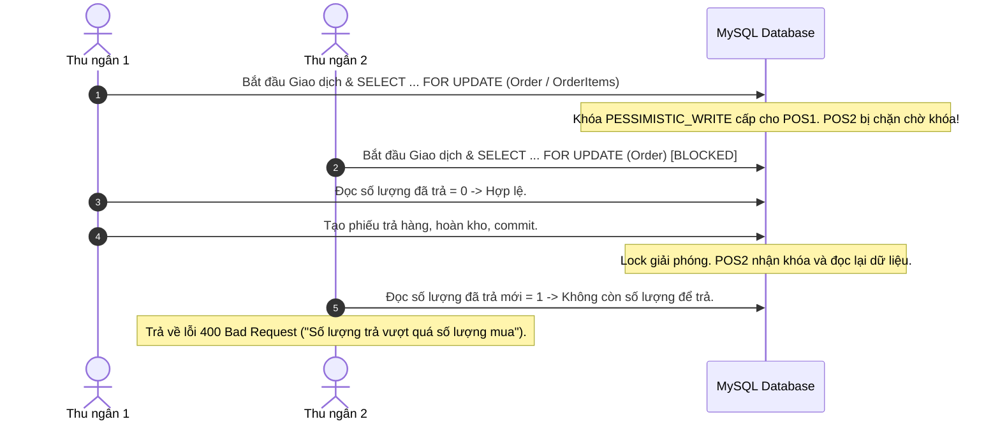
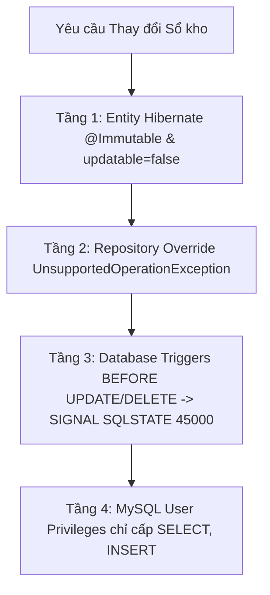
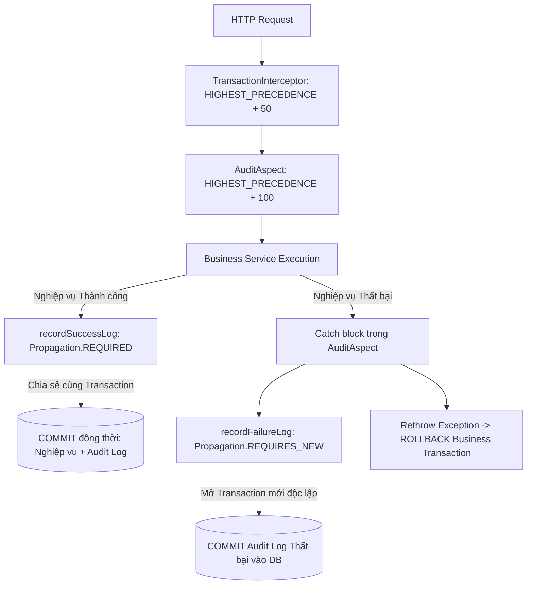
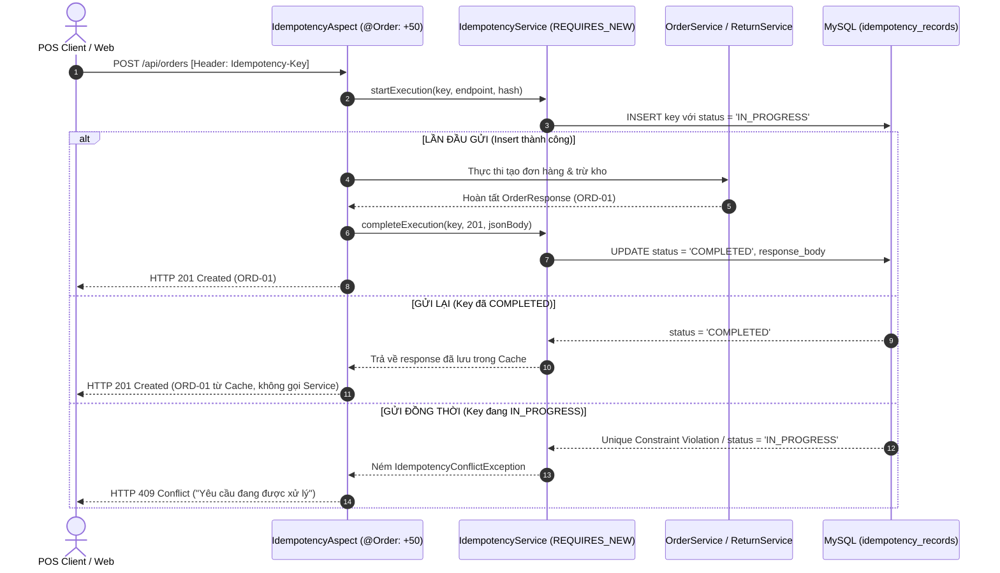

# BIZPOS ARCHITECTURE DECISIONS & ENGINEERING TRADE-OFFS
## Tài liệu Kiến trúc Hệ thống & Phân tích Đánh đổi Kỹ thuật

> **Mục tiêu tài liệu:** Ghi chép chi tiết các quyết định thiết kế (Architecture Decision Records - ADR), giải pháp kỹ thuật cho các bài toán phân tán/đồng thời trong bán lẻ (concurrency, race conditions, data consistency), kèm theo phân tích trade-offs và những hạn chế kỹ thuật đã biết của hệ thống BizPOS.

---

## MỤC LỤC
1. [Tổng quan Ngữ cảnh Kỹ thuật (System Context)](#1-tổng-quan-ngữ-cảnh-kỹ-thuật-system-context)
2. [Quản lý Giao dịch Đổi - Trả & Chống Race Condition](#2-quản-lý-giao-dịch-đổi---trả--chống-race-condition)
3. [Thuật toán Tính toán Tài chính & Phân bổ Chiết khấu Lũy kế](#3-thuật-toán-tính-toán-tài-chính--phân-bổ-chiết-khấu-lũy-kế)
4. [Bảo vệ Sổ cái Kho Bất biến (Append-Only Inventory Ledger)](#4-bảo-vệ-sổ-cái-kho-bất-biến-append-only-inventory-ledger)
5. [Chiến lược Audit Log Kép (Dual Transaction Propagation Strategy)](#5-chiến-lược-audit-log-kép-dual-transaction-propagation-strategy)
6. [Tính Lũy Đẳng trong Xử lý Giao dịch (Idempotency Pattern)](#6-tính-lũy-đẳng-trong-xử-lý-giao-dịch-idempotency-pattern)
7. [Hạn chế Đã biết & Hướng Phát triển (Known Limitations & Future Work)](#7-hạn-chế-đã-biết--hướng-phát-triển-known-limitations--future-work)
8. [Đối chiếu Kiểm thử Thực nghiệm (Verification Matrix)](#8-đối-chiếu-kiểm-thử-thực-nghiệm-verification-matrix)

---

## 1. TỔNG QUAN NGỮ CẢNH KỸ THUẬT (SYSTEM CONTEXT)

Hệ thống BizPOS được thiết kế cho chuỗi bán lẻ thời trang hoạt động theo mô hình:
- **Môi trường vận hành:** Đa quầy thu ngân (Multi-terminal POS), nhiều nhân viên thao tác cùng lúc trên cơ sở dữ liệu dùng chung.
- **Thách thức cốt lõi:**
  - Nguy cơ tranh chấp tài nguyên (Concurrency) khi nhiều thu ngân cùng xử lý một hóa đơn hoặc cùng xuất bán/trả hàng cho một mã SKU tồn kho thấp.
  - Tính toàn vẹn số liệu tài chính: Doanh thu thuần (Net Revenue), tiền thực thu sau chiết khấu, và đối soát tiền mặt/chuyển khoản.
  - Ngăn ngừa gian lận nội bộ: Tự ý sửa sổ kho, sửa lịch sử giao dịch, hoặc thao tác vượt quyền.

---

## 2. QUẢN LÝ GIAO DỊCH ĐỔI - TRẢ & CHỐNG RACE CONDITION

### 2.1. Bài toán Race Condition khi Thao tác Đồng thời
Trong môi trường bán lẻ nhiều quầy POS, hai kịch bản xung đột phổ biến gồm:
1. **Hai thu ngân cùng thao tác trả hàng trên cùng một hóa đơn gốc tại cùng thời điểm.**
2. **Thu ngân đang tạo phiếu trả hàng trong lúc Quản lý (ADMIN) thực hiện hủy đơn (hoàn kho) của cùng hóa đơn đó.**

Nếu chỉ khóa sản phẩm (`PESSIMISTIC_WRITE` trên bảng `products`) mà không khóa đơn hàng gốc, cả hai luồng sẽ đọc trạng thái cũ của hóa đơn và cùng cho phép hoàn tiền $\to$ thất thoát tài chính và cộng lặp tồn kho.

### 2.2. Chiến lược Khóa Tuần tự (Strict Global Lock Ordering)
Để loại trừ nguy cơ Deadlock khi nhiều luồng cùng khóa nhiều tài nguyên khác nhau, BizPOS quy định thứ tự khóa bất biến cho mọi service:

$$\mathbf{Order\ (Khóa\ trước)} \longrightarrow \mathbf{Products\ (Sắp\ xếp\ ID\ tăng\ dần)} \longrightarrow \mathbf{Variants\ (Sắp\ xếp\ ID\ tăng\ dần)}$$

- Triển khai: Sử dụng `TreeSet<Long>` trong [OrderReturnServiceImpl.java](../src/main/java/com/bizpos/service/impl/OrderReturnServiceImpl.java) và [OrderServiceImpl.java](../src/main/java/com/bizpos/service/impl/OrderServiceImpl.java) để sắp xếp ID sản phẩm trước khi gọi `findWithLockByIdIn()`.
- Xử lý đua lệnh với Hủy đơn: Ngay sau khi nhận lock, kiểm tra `order.getStatus()`. Nếu đơn đã `CANCELLED` hoặc `RETURNED`, từ chối thao tác ngay lập tức. Trong luồng hủy đơn, lượng hàng hoàn kho thực tế được tính bằng:
  $$\text{restockQuantity} = \text{orderedQuantity} - \text{alreadyReturnedQuantity}$$

---

## 3. THUẬT TOÁN TÍNH TOÁN TÀI CHÍNH & PHÂN BỔ CHIẾT KHẤU LŨY KẾ

### 3.1. Vấn đề Sai số Làm tròn khi Trả Hàng Từng Phần
Khi đơn hàng có chiết khấu toàn đơn (Discount Amount), số tiền thực thu của mỗi dòng hàng bị giảm theo tỷ lệ:
- Khách mua 3 sản phẩm có chiết khấu, số tiền thực trả là 1.000.000 VNĐ.
- Giá trị bình quân: $1.000.000 / 3 = 333.333,333...$ VNĐ.
- Nếu mỗi lần trả hàng làm tròn độc lập $333.333$ VNĐ, sau 3 lần trả khách chỉ nhận $999.999$ VNĐ (thất thoát 1 đồng, vi phạm tính toàn vẹn kế toán).

### 3.2. Thuật toán Hoàn tiền Lũy kế (Cumulative Refund Algorithm)
BizPOS áp dụng thuật toán lũy kế (tương tự chuẩn Shopify/Stripe) trong [OrderReturnServiceImpl.java](../src/main/java/com/bizpos/service/impl/OrderReturnServiceImpl.java):

1. **Phân bổ chiết khấu cho từng dòng hàng:**
   $$\text{lineDiscount} = \text{discountAmount} \times \frac{\text{lineTotal}}{\text{subtotal}}$$
   $$\text{lineNet} = \text{lineTotal} - \text{lineDiscount}$$

2. **Hàm tính số tiền hoàn lũy kế cho $q$ sản phẩm:**
   $$\text{cumulativeRefund}(q) = \text{round}\left( \frac{\text{lineNet} \times q}{\text{qtyOrdered}} \right)$$

3. **Số tiền hoàn thực tế của lần trả hiện tại:**
   $$\text{refundThisTime} = \text{cumulativeRefund}(\text{alreadyReturnedQty} + \text{returnQty}) - \text{cumulativeRefund}(\text{alreadyReturnedQty})$$

Thuật toán tự động bù sai số làm tròn vào các lần trả tiếp theo, đảm bảo tổng số tiền hoàn qua tất cả các lần luôn bằng chính xác 100% giá trị thực thu ban đầu.

---

## 4. BẢO VỆ SỔ CÁI KHO BẤT BIẾN (APPEND-ONLY INVENTORY LEDGER)

Sổ kho (`stock_movements`) là nguồn sự thật (Single Source of Truth) để đối soát biến động hàng hóa. Để ngăn chặn gian lận số liệu kiểm kê, hệ thống áp dụng cơ chế phòng thủ 4 tầng:

### 4.1. Công thức Đối soát Kho (Inventory Reconciliation)
Thay vì dùng nhiều biến rời rạc, mọi biến động kho được chuẩn hóa thành **Delta có dấu ($\Delta$)**:
$$\Delta = \text{current\_stock} - \text{previous\_stock}$$

- Bán hàng (`SALE`): $\Delta < 0$
- Nhập kho (`IMPORT`), Hoàn hàng (`RETURN`): $\Delta > 0$
- Điều chỉnh kiểm kê (`ADJUSTMENT`): $\Delta = \text{new} - \text{old}$ (có thể âm hoặc dương)

Điều kiện đối soát hợp lệ tại [StockMovementServiceImpl.java](../src/main/java/com/bizpos/service/impl/StockMovementServiceImpl.java):
$$\mathbf{Tồn\ kho\ hiện\ tại} = \mathbf{Tồn\ ban\ đầu} + \sum_{i=1}^n \Delta_i$$

### 4.2. Kiểm soát Quyền Điều chỉnh Tồn kho (`PATCH /stock`)
- Bắt buộc nhập lý do điều chỉnh (`reason` $\ge 3$ ký tự), ghi thẳng vào ghi chú thẻ kho.
- **Phân quyền có hạn mức (Staff Guard Threshold):**
  - Tài khoản Nhân viên (`STAFF`): Chỉ được phép điều chỉnh tồn kho trong phạm vi $|\Delta| \le 10$ món/lần.
  - Nếu chênh lệch $|\Delta| > 10$: Hệ thống ném `AccessDeniedException` (HTTP 403), yêu cầu Quản lý (`ADMIN`) thực hiện.

---

## 5. CHIẾN LƯỢC AUDIT LOG KÉP (DUAL TRANSACTION PROPAGATION STRATEGY)

Trong ghi nhận lịch sử kiểm toán (Audit Logging), hệ thống đối mặt với hai rủi ro trái ngược nhau:
- **Rủi ro "Log ma" (Phantom Log):** Nếu ghi log thành công ở một transaction độc lập (`REQUIRES_NEW`), khi nghiệp vụ chính bị lỗi và rollback, log thành công đã commit vẫn tồn tại $\to$ sai lệch dữ liệu kiểm toán.
- **Rủi ro "Mất dấu vết vi phạm":** Nếu ghi log thất bại cùng transaction với nghiệp vụ chính, khi exception xảy ra, transaction rollback sẽ xóa sạch luôn bản ghi cảnh báo vi phạm.

### 5.1. Giải pháp Thiết kế: Phân định Transaction có Chủ đích

- **Thứ tự thực thi:** `TransactionInterceptor` được cấu hình mở transaction trước (`order = HIGHEST_PRECEDENCE + 50`), `AuditAspect` chạy bên trong transaction đó (`order = HIGHEST_PRECEDENCE + 100`).
- **Phòng thủ Storage Exhaustion:** Áp dụng [LoginRateLimiter.java](../src/main/java/com/bizpos/security/LoginRateLimiter.java) giới hạn tối đa 5 lần đăng nhập sai trong 5 phút. Khi chạm ngưỡng, ghi 1 cảnh báo duy nhất (`LOGIN_LOCKED`), các lần spam tiếp theo bị chặn ở tầng filter với HTTP 429 Too Many Requests mà không insert log rác vào DB.

---

## 6. TÍNH LŨY ĐẲNG TRONG XỬ LÝ GIAO DỊCH (IDEMPOTENCY PATTERN)

> *Lưu ý thuật ngữ kỹ thuật:* **Tính lũy đẳng (Idempotency)** là tính chất một thao tác khi thực hiện nhiều lần mang lại cùng kết quả như thực hiện một lần ($f(f(x)) = f(x)$). (Không nhầm lẫn với "lũy thừa" - exponentiation).

### 6.1. Quy trình Xử lý qua Vòng đời Idempotency

### 6.2. Các Trường hợp Biên Đã Xử lý (Edge Cases)
1. **Phân xử đồng thời bằng Unique Constraint:** Sử dụng `saveAndFlush()` trên bảng `idempotency_records`. Khi hai thread gửi cùng key trong cùng mili-giây, MySQL ném `DataIntegrityViolationException`, tầng service chuyển đổi thành HTTP 409 Conflict thay vì văng lỗi 500 không mong muốn.
2. **Không cache khi nghiệp vụ thất bại:** Nếu nghiệp vụ trả về lỗi (4xx, 5xx) hoặc ném exception, hệ thống kích hoạt `failExecution(key)` để xóa bản ghi, cho phép người dùng thử lại ngay lập tức.
3. **Phát hiện Payload Mismatch:** Băm SHA-256 nội dung request. Nếu gửi cùng key nhưng khác nội dung đơn hàng, hệ thống trả về **HTTP 422 Unprocessable Entity**.
4. **Cơ chế Timeout (TTL 120s):** Nếu tiến trình server bị dừng đột ngột khi đang xử lý (kẹt `IN_PROGRESS`), bản ghi có `locked_at` quá 2 phút sẽ được tự động giải phóng.

---

## 7. HẠN CHẾ ĐÃ BIẾT & HƯỚNG PHÁT TRIỂN (KNOWN LIMITATIONS & FUTURE WORK)

Từ góc độ thiết kế hệ thống thực tế, kiến trúc hiện tại của BizPOS có các đánh đổi kỹ thuật (trade-offs) và những hạn chế sau:

### 7.1. Khóa Bi quan (Pessimistic Locking) trong Môi trường Cơ sở Dữ liệu Đơn lẻ
- **Hiện trạng:** Hệ thống đang sử dụng `SELECT ... FOR UPDATE` trực tiếp trên một instance MySQL duy nhất.
- **Hạn chế:** Khi mở rộng quy mô (Scale out) sang kiến trúc nhiều database replica (Read/Write splitting) hoặc Sharding, Pessimistic Locking truyền thống sẽ gặp khó khăn trong việc đồng bộ trạng thái khóa.
- **Hướng phát triển:** Chuyển sang cơ chế **Distributed Lock** sử dụng Redis (Redisson/Redlock) hoặc Zookeeper khi kiến trúc chuyển dịch sang cụm phân tán.

### 7.2. Tải Ghi Audit Log Đồng bộ (Synchronous Audit Persistence)
- **Hiện trạng:** Audit log được ghi trực tiếp vào MySQL qua JDBC connection (cùng transaction hoặc qua `REQUIRES_NEW`).
- **Hạn chế:** Khi lưu lượng giao dịch tăng đột biến (ví dụ dịp flash sale), việc ghi audit log đồng bộ có thể chiếm dụng connection trong HikariCP pool, làm tăng latency của nghiệp vụ chính.
- **Hướng phát triển:** Áp dụng **Transactional Outbox Pattern** kết hợp Message Broker (Apache Kafka / RabbitMQ) để đẩy sự kiện audit bất đồng bộ (Asynchronous Event-Driven Audit) ra ngoài, tách biệt hoàn toàn tải ghi giữa POS core và hệ thống Audit/Analytics.

### 7.3. Lưu trữ Idempotency Key
- **Hiện trạng:** Bản ghi Idempotency được lưu trên bảng MySQL và dọn dẹp định kỳ bằng `@Scheduled` cron job.
- **Hạn chế:** Bảng MySQL có thể tăng kích thước nhanh nếu số lượng giao dịch lớn trong ngày, và thao tác dọn dẹp hàng loạt bằng DELETE có thể gây khóa phân mảnh index.
- **Hướng phát triển:** Sử dụng **Redis In-Memory** với cơ chế Native Key TTL (tự động hết hạn và giải phóng bộ nhớ sau $N$ phút/giờ) để tối ưu IOPS cho cơ sở dữ liệu quan hệ.

### 7.4. Phương thức Hoàn tiền & Store Credit
- **Hiện trạng:** Đã loại bỏ lựa chọn `CREDIT_VOUCHER` do chưa có bảng theo dõi số dư công nợ khách hàng, chỉ giữ lại `CASH` và `BANK_TRANSFER`.
- **Hướng phát triển:** Xây dựng module **Customer Wallet / Store Credit Ledger** độc lập với sổ cái tín dụng hai chiều (`credit_ledger`), hỗ trợ phát hành voucher điện tử có mã định danh, hạn dùng và giá trị khấu trừ lũy kế.

### 7.5. Tự động hóa Đối soát Thanh toán Ngân hàng
- **Hiện trạng:** Phương thức `BANK_TRANSFER` hiện đóng vai trò ghi nhận thao tác thu ngân đã kiểm tra ủy nhiệm chi/tài khoản thụ hưởng tại quầy.
- **Hướng phát triển:** Tích hợp trực tiếp Webhook cổng thanh toán ngân hàng (VietQR động qua Casso/SePAY hoặc cổng thanh toán trung gian) để tự động đối soát giao dịch thời gian thực theo mã đơn hàng.

---

## 8. ĐỐI CHIẾU KIỂM THỬ THỰC NGHIỆM (VERIFICATION MATRIX)

Toàn bộ các giải pháp kiến trúc nêu trên được kiểm chứng qua bộ kiểm thử tự động gồm **215 bài test** (đạt tỷ lệ vượt qua 100% trong môi trường test tích hợp độc lập):

| Vấn đề Kiến trúc | Giải pháp Thiết kế | Lớp Triển khai | Bài Test Tích hợp Xác minh |
| :--- | :--- | :--- | :--- |
| **Race Condition Đổi trả** | Khóa PESSIMISTIC_WRITE trên Order & Sản phẩm tuần tự | [OrderReturnServiceImpl.java](../src/main/java/com/bizpos/service/impl/OrderReturnServiceImpl.java) | [OrderReturnIntegrationTest.java](../src/test/java/com/bizpos/OrderReturnIntegrationTest.java) *(Test 7, 15)* |
| **Xung đột Hủy đơn vs Trả hàng** | Kiểm tra trạng thái đơn & tính toán số lượng tồn còn lại | [OrderServiceImpl.java](../src/main/java/com/bizpos/service/impl/OrderServiceImpl.java) | [OrderInventoryIntegrationTest.java](../src/test/java/com/bizpos/OrderInventoryIntegrationTest.java) |
| **Sai số Chiết khấu Lũy kế** | Thuật toán Cumulative Refund bù tròn số học | [OrderReturnServiceImpl.java](../src/main/java/com/bizpos/service/impl/OrderReturnServiceImpl.java) | [OrderReturnIntegrationTest.java](../src/test/java/com/bizpos/OrderReturnIntegrationTest.java) *(Test 13)* |
| **Trạng thái Trả một phần** | Cập nhật `PARTIALLY_RETURNED` và `RETURNED` | [OrderStatus.java](../src/main/java/com/bizpos/enums/OrderStatus.java) | [OrderReturnIntegrationTest.java](../src/test/java/com/bizpos/OrderReturnIntegrationTest.java) *(Test 15)* |
| **Duyệt Ngoại lệ Thời hạn** | Xác thực Quản lý tại quầy (mật khẩu) & lưu vết `approved_by` | [OrderReturnServiceImpl.java](../src/main/java/com/bizpos/service/impl/OrderReturnServiceImpl.java) | [OrderReturnIntegrationTest.java](../src/test/java/com/bizpos/OrderReturnIntegrationTest.java) *(Test 16, 17)* |
| **Doanh thu thuần Dashboard** | Bù trừ dòng tiền ròng `net_amount` | [DashboardServiceImpl.java](../src/main/java/com/bizpos/service/impl/DashboardServiceImpl.java) | [DashboardIntegrationTest.java](../src/test/java/com/bizpos/DashboardIntegrationTest.java) |
| **Bảo vệ Sổ kho Bất biến** | 4-Tier Immutability (Entity, Repo, Triggers, DB Grants) | [StockMovementServiceImpl.java](../src/main/java/com/bizpos/service/impl/StockMovementServiceImpl.java) | [StockMovementIntegrationTest.java](../src/test/java/com/bizpos/StockMovementIntegrationTest.java) |
| **Hạn mức Tồn kho Nhân viên** | Bắt buộc `reason`, chặn $|\Delta| > 10$ với STAFF | [ProductServiceImpl.java](../src/main/java/com/bizpos/service/impl/ProductServiceImpl.java) | [SecurityIntegrationTest.java](../src/test/java/com/bizpos/SecurityIntegrationTest.java) |
| **Cô lập Giao dịch Audit Log** | REQUIRED cho success, REQUIRES_NEW cho failure | [AuditAspect.java](../src/main/java/com/bizpos/aspect/AuditAspect.java) | [AuditLogIntegrationTest.java](../src/test/java/com/bizpos/AuditLogIntegrationTest.java) |
| **Chống Phình Bảng Audit Log** | Rate Limiter 5 lần thử sai / 5 phút $\to$ 429 | [LoginRateLimiter.java](../src/main/java/com/bizpos/security/LoginRateLimiter.java) | [AuditLogIntegrationTest.java](../src/test/java/com/bizpos/AuditLogIntegrationTest.java) *(Test 9)* |
| **Tính Lũy Đẳng (Idempotency)** | Aspect bọc ngoài Transaction, Unique Constraint, TTL | [IdempotencyAspect.java](../src/main/java/com/bizpos/aspect/IdempotencyAspect.java) | [IdempotencyIntegrationTest.java](../src/test/java/com/bizpos/IdempotencyIntegrationTest.java) *(Test 1-8)* |
